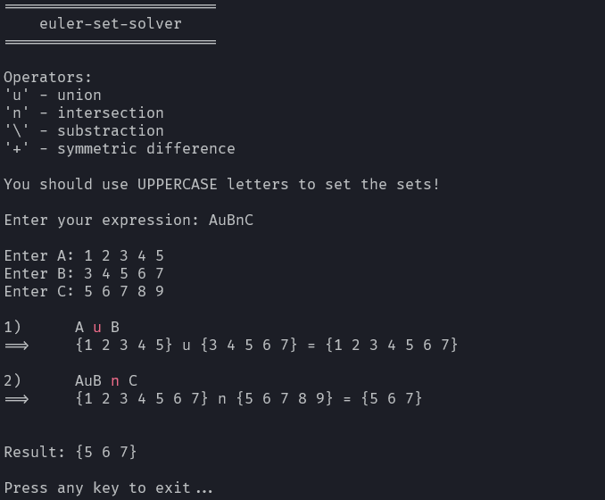
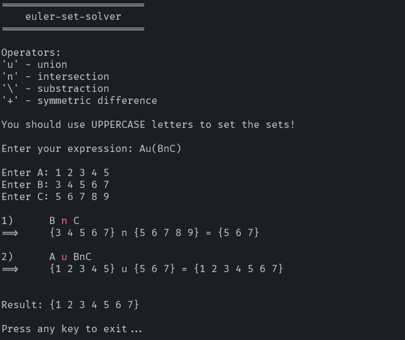

# euler-set-solver

[](https://github.com/andinoriel/euler-set-solver/actions/workflows/build.yml)
[](https://opensource.org/licenses/MIT)

euler-set-solver - recursive descent parser that design for evaluating and solving expressions of the set theory.

euler-set-solver written on C++/Cli which means(for now, at least) that you can only use this project on Windows
with the Visual Studio based building tools.

# Build

1. Make sure that you have successfully install the Visual Studio or Visual Studio build tools with
wthis components:
* "Desktop development with C++";
* ".NET Framework targeting pack" and ".NET Framework SDK" (any version starting from v4.0);
* "C++ core features"
* "C++/CLI support for build tools" (any version of build tools starting from v140);
* "Windows 10 SDK".

2. After that, you can configure the project:
```
$ cmake -B ./build -G <preferred generator>

OR

$ task configure -- <preferred generator>
```
> Note that 'preferred generator' must be a Visual Studio based generator,
> for example: "Visual Studio 15 2017"

> For configuring with the "Visual Studio 16 2019" generator, you can use:
> ```
> $ task vsconfigure
> ```

1. Run the build command or open Visual Studio solution in the ./build directory for manual build:
```
$ cmake --build ./build --config <Debug|Release>

OR

$ task build_<debug|release>
```

4. You've done! The builded binary file available in the build directory.

## Testing

To run project tests:

1. Configure the project:
```
$ cmake -B ./build -G <preferred generator>

OR

$ task configure -- <preferred generator>
```

2. Run tests command:
```
$ cmake --build ./build --config <Debug|Release> --target run-tests

OR

$ task test
```

# Screenshots

<details>
  <summary>Expand</summary>

  <p align="center">
    
    
  </p>
</details>

# License

This project is licensed under the [MIT License](LICENSE).

## Credits

My thanks to the developers of [Colorful.Console](https://github.com/tomakita/Colorful.Console).
